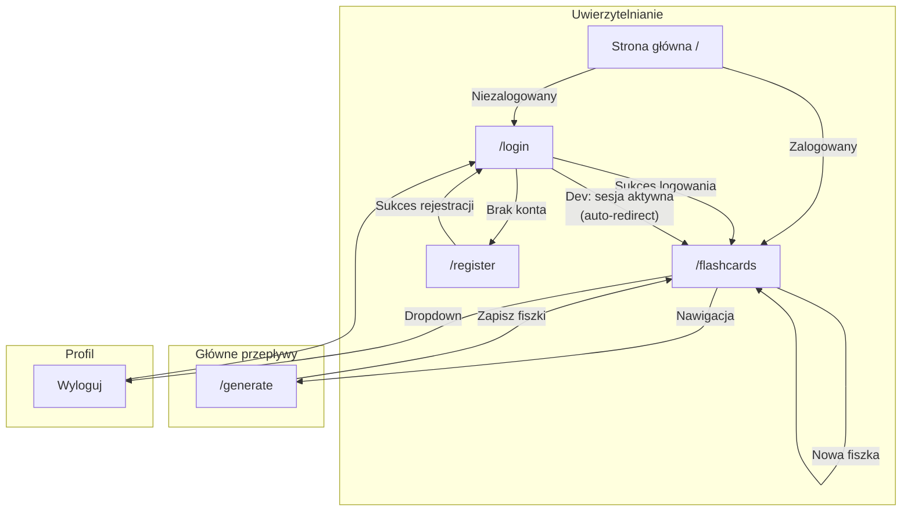

# Architektura UI dla aplikacji 10x-cards

## 1. Przegląd struktury UI

Aplikacja 10x-cards to webowa platforma do tworzenia i nauki fiszek edukacyjnych z wykorzystaniem AI. Architektura UI
opiera się na następujących założeniach:

### Stack technologiczny

- **Framework**: Astro 5 (routing, SSR) + React 19 (komponenty interaktywne)
- **Styling**: Tailwind CSS 4
- **Komponenty UI**: Shadcn/ui (wariant "new-york", kolor bazowy "neutral")
- **Powiadomienia**: Sonner (toast notifications)

### Zasady architektoniczne

- **Prostota ponad elastyczność** - natywne mechanizmy React (useState, useEffect, fetch) zamiast zewnętrznych bibliotek
- **Mobile-first responsive design** - zgodnie z domyślnym podejściem Tailwind CSS
- **Per-komponent** obsługa stanów (loading, error, empty) z reużywalnymi komponentami
- **Feature-based** organizacja kodu

### Struktura layoutów

```
┌─────────────────────────────────────────────────────────────┐
│                     BaseLayout.astro                        │
│  (HTML wrapper, meta tagi, Sonner provider)                 │
│  ┌───────────────────────────────────────────────────────┐  │
│  │                   AppLayout.astro                     │  │
│  │  ┌─────────────────────────────────────────────────┐  │  │
│  │  │              Navbar (top navigation)            │  │  │
│  │  └─────────────────────────────────────────────────┘  │  │
│  │  ┌─────────────────────────────────────────────────┐  │  │
│  │  │                   <main>                        │  │  │
│  │  │              (zawartość strony)                 │  │  │
│  │  └─────────────────────────────────────────────────┘  │  │
│  │  ┌─────────────────────────────────────────────────┐  │  │
│  │  │              Footer (opcjonalny)                │  │  │
│  │  └─────────────────────────────────────────────────┘  │  │
│  └───────────────────────────────────────────────────────┘  │
└─────────────────────────────────────────────────────────────┘
```

- **BaseLayout.astro** - używany dla stron auth (login, register) - bez nawigacji
- **AppLayout.astro** - używany dla chronionych stron - z nawigacją

---

## 2. Lista widoków

### 2.1 Strona główna (/)

| Aspekt                  | Opis                                                   |
|-------------------------|--------------------------------------------------------|
| **Ścieżka**             | `/`                                                    |
| **Główny cel**          | Przekierowanie użytkownika do odpowiedniego widoku     |
| **Kluczowe informacje** | Brak - tylko logika przekierowania                     |
| **Kluczowe komponenty** | Brak komponentów UI                                    |
| **UX**                  | Automatyczne przekierowanie bez interakcji użytkownika |
| **Dostępność**          | N/A                                                    |
| **Bezpieczeństwo**      | Sprawdzenie sesji Supabase przed przekierowaniem       |

**Logika przekierowania:**

- Zalogowany użytkownik → `/flashcards`
- Niezalogowany użytkownik → `/login`

---

### 2.2 Strona logowania (/login)

| Aspekt                  | Opis                                                                                   |
|-------------------------|----------------------------------------------------------------------------------------|
| **Ścieżka**             | `/login`                                                                               |
| **Główny cel**          | Uwierzytelnienie istniejącego użytkownika                                              |
| **Kluczowe informacje** | Formularz logowania (email, hasło), link do rejestracji                                |
| **Kluczowe komponenty** | `LoginForm` (inspirowany blokiem login-01 z shadcn/blocks), `Input`, `Button`, `Alert` |
| **UX**                  | Walidacja on-blur + on-submit, wyraźne komunikaty błędów                               |
| **Dostępność**          | Pełna obsługa klawiatury, aria-labels dla pól, focus management                        |
| **Bezpieczeństwo**      | Walidacja client-side + server-side, brak ujawniania czy email istnieje                |

**Walidacja formularza:**

- Email: wymagany, format email
- Hasło: wymagane, minimum 8 znaków

**Wireframe:**

```
┌─────────────────────────────────────────────────┐
│                                                 │
│              ┌─────────────────────┐            │
│              │    [Logo 10x-cards] │            │
│              │                     │            │
│              │   Zaloguj się       │            │
│              │                     │            │
│              │   Email             │            │
│              │   [________________]│            │
│              │                     │            │
│              │   Hasło             │            │
│              │   [________________]│            │
│              │                     │            │
│              │   [  Zaloguj się  ] │            │
│              │                     │            │
│              │   Nie masz konta?   │            │
│              │   Zarejestruj się   │            │
│              └─────────────────────┘            │
│                                                 │
└─────────────────────────────────────────────────┘
```

---

### 2.3 Strona rejestracji (/register)

| Aspekt                  | Opis                                                    |
|-------------------------|---------------------------------------------------------|
| **Ścieżka**             | `/register`                                             |
| **Główny cel**          | Utworzenie nowego konta użytkownika                     |
| **Kluczowe informacje** | Formularz rejestracji (email, hasło), link do logowania |
| **Kluczowe komponenty** | `RegisterForm`, `Input`, `Button`, `Alert`              |
| **UX**                  | Analogicznie do logowania, potwierdzenie sukcesu        |
| **Dostępność**          | Pełna obsługa klawiatury, aria-labels, focus management |
| **Bezpieczeństwo**      | Walidacja siły hasła, sanityzacja email                 |

**Walidacja formularza:**

- Email: wymagany, format email
- Hasło: wymagane, minimum 8 znaków

**Przepływ po rejestracji:**

- Po pomyślnej rejestracji użytkownik jest **przekierowywany do strony logowania** (`/login`)
- `supabase.auth.signUp()` tworzy konto użytkownika i ustawia cookies sesji
- **PRODUKCJA (email confirmation WŁĄCZONE):** Użytkownik musi potwierdzić email przed pierwszym logowaniem. Pole `email_confirmed_at` w bazie jest `null` dopóki użytkownik nie kliknie linku w emailu.
- **DEVELOPMENT (email confirmation WYŁĄCZONE):** Email jest "implicitly confirmed" przez Supabase - pole `email_confirmed_at` jest ustawiane automatycznie. Użytkownik po przekierowaniu do `/login` zostanie od razu przekierowany do `/flashcards` (middleware wykryje aktywną sesję).

> **Uwaga dla developmentu:** W środowisku dev użytkownik po rejestracji zostanie przekierowany do `/login`, ale ponieważ sesja jest już aktywna (brak wymogu potwierdzenia email), middleware natychmiast przekieruje go do `/flashcards`. To oczekiwane zachowanie.

---

### 2.4 Widok generowania fiszek (/generate)

| Aspekt                  | Opis                                                                                                |
|-------------------------|-----------------------------------------------------------------------------------------------------|
| **Ścieżka**             | `/generate`                                                                                         |
| **Główny cel**          | Generowanie propozycji fiszek przez AI na podstawie tekstu źródłowego                               |
| **Kluczowe informacje** | Pole tekstowe, propozycje fiszek, licznik zaakceptowanych                                           |
| **Kluczowe komponenty** | `GenerationForm`, `ProposalCard`, `ProposalList`, `Textarea`, `Button`, `Card`, `Skeleton`, `Alert` |
| **UX**                  | Single-page flow z progressive disclosure, inline editing                                           |
| **Dostępność**          | Aria-live dla dynamicznych aktualizacji, focus management po generowaniu                            |
| **Bezpieczeństwo**      | Wymaga uwierzytelnienia, walidacja długości tekstu                                                  |

**Wymagana długość tekstu źródłowego:** 1000-10000 znaków

**Wireframe - stan początkowy:**

```
┌─────────────────────────────────────────────────────────────┐
│ [Logo] [Generowanie] [Moje fiszki] .............. [User ▼] │
├─────────────────────────────────────────────────────────────┤
│                                                             │
│  Generuj fiszki z tekstu                                    │
│  ───────────────────────                                    │
│                                                             │
│  Wklej tekst źródłowy (1000-10000 znaków)                   │
│  ┌─────────────────────────────────────────────────────┐    │
│  │                                                     │    │
│  │  [Textarea - miejsce na tekst]                      │    │
│  │                                                     │    │
│  │                                                     │    │
│  └─────────────────────────────────────────────────────┘    │
│  Znaków: 0/10000                                            │
│                                                             │
│  [ Generuj fiszki ]                                         │
│                                                             │
└─────────────────────────────────────────────────────────────┘
```

**Wireframe - stan z propozycjami:**

```
┌─────────────────────────────────────────────────────────────┐
│ [Logo] [Generowanie] [Moje fiszki] .............. [User ▼] │
├─────────────────────────────────────────────────────────────┤
│                                                             │
│  Generuj fiszki z tekstu                                    │
│  ───────────────────────                                    │
│                                                             │
│  [Textarea - zwinięte lub z tekstem]                        │
│  [ Generuj ponownie ]                                       │
│                                                             │
│  ─────────────────────────────────────────────────────────  │
│                                                             │
│  Propozycje fiszek (5)                 Zaakceptowane: 3     │
│                                                             │
│  ┌───────────────────────────────────────────────────────┐  │
│  │ Front: "Co to jest fotosynteza?"           [✏️ Edytuj]│  │
│  ├───────────────────────────────────────────────────────┤  │
│  │ Back: "Proces przekształcania energii..."  [✏️ Edytuj]│  │
│  ├───────────────────────────────────────────────────────┤  │
│  │ [✓ Zaakceptowana]                    [✗ Odrzuć]       │  │
│  └───────────────────────────────────────────────────────┘  │
│                                                             │
│  ┌───────────────────────────────────────────────────────┐  │
│  │ Front: "Jakie są produkty fotosyntezy?"    [✏️ Edytuj]│  │
│  ├───────────────────────────────────────────────────────┤  │
│  │ Back: "Glukoza i tlen"                     [✏️ Edytuj]│  │
│  ├───────────────────────────────────────────────────────┤  │
│  │ [✓ Akceptuj]                         [✗ Odrzuć]       │  │
│  └───────────────────────────────────────────────────────┘  │
│                                                             │
│  ... (więcej propozycji)                                    │
│                                                             │
│  [ Zapisz zaakceptowane (3) ]                               │
│                                                             │
└─────────────────────────────────────────────────────────────┘
```

**Stany komponentu:**

- **Pusty**: Tylko textarea i przycisk "Generuj"
- **Ładowanie**: Skeleton dla propozycji, przycisk "Generuj" disabled z spinnerem
- **Błąd**: Alert z komunikatem i przyciskiem "Spróbuj ponownie"
- **Sukces**: Lista propozycji z możliwością interakcji

---

### 2.5 Widok "Moje fiszki" (/flashcards)

| Aspekt                  | Opis                                                                                                                                        |
|-------------------------|---------------------------------------------------------------------------------------------------------------------------------------------|
| **Ścieżka**             | `/flashcards`                                                                                                                               |
| **Główny cel**          | Przeglądanie, wyszukiwanie i zarządzanie zapisanymi fiszkami                                                                                |
| **Kluczowe informacje** | Lista fiszek, paginacja, wyszukiwarka, źródło fiszki                                                                                        |
| **Kluczowe komponenty** | `FlashcardList`, `FlashcardCard`, `FlashcardEditDialog`, `FlashcardEmpty`, `Input`, `Pagination`, `Card`, `Dialog`, `AlertDialog`, `Button` |
| **UX**                  | Wyszukiwanie z debounce, paginacja, modal dla edycji                                                                                        |
| **Dostępność**          | Aria-labels dla akcji, focus trap w modalach, keyboard navigation                                                                           |
| **Bezpieczeństwo**      | RLS - użytkownik widzi tylko swoje fiszki                                                                                                   |

**Wireframe - stan z danymi:**

```
┌─────────────────────────────────────────────────────────────┐
│ [Logo] [Generowanie] [Moje fiszki] .............. [User ▼] │
├─────────────────────────────────────────────────────────────┤
│                                                             │
│  Moje fiszki                              [+ Nowa fiszka]   │
│  ────────────                                               │
│                                                             │
│  [🔍 Szukaj fiszek...                                    ]  │
│                                                             │
│  ┌─────────────────────────┐ ┌─────────────────────────┐    │
│  │ Front: "Co to jest..."  │ │ Front: "Jakie są..."    │    │
│  │ ──────────────────────  │ │ ──────────────────────  │    │
│  │ Back: "To jest..."      │ │ Back: "Produkty to..."  │    │
│  │                         │ │                         │    │
│  │ 📱 AI | 15.01.2024      │ │ ✍️ Manual | 14.01.2024  │    │
│  │ [Edytuj]        [🗑️]    │ │ [Edytuj]        [🗑️]    │    │
│  └─────────────────────────┘ └─────────────────────────┘    │
│                                                             │
│  ┌─────────────────────────┐ ┌─────────────────────────┐    │
│  │ Front: "Gdzie..."       │ │ Front: "Kiedy..."       │    │
│  │ ...                     │ │ ...                     │    │
│  └─────────────────────────┘ └─────────────────────────┘    │
│                                                             │
│  [< Poprzednia] [1] [2] [3] ... [10] [Następna >]           │
│                                                             │
└─────────────────────────────────────────────────────────────┘
```

**Wireframe - stan pusty:**

```
┌─────────────────────────────────────────────────────────────┐
│ [Logo] [Generowanie] [Moje fiszki] .............. [User ▼] │
├─────────────────────────────────────────────────────────────┤
│                                                             │
│  Moje fiszki                              [+ Nowa fiszka]   │
│  ────────────                                               │
│                                                             │
│              ┌─────────────────────────────┐                │
│              │                             │                │
│              │      📚                     │                │
│              │                             │                │
│              │   Nie masz jeszcze fiszek   │                │
│              │                             │                │
│              │   Wygeneruj swoje pierwsze  │                │
│              │   fiszki z tekstu lub       │                │
│              │   dodaj je ręcznie.         │                │
│              │                             │                │
│              │   [Generuj fiszki]          │                │
│              │                             │                │
│              └─────────────────────────────┘                │
│                                                             │
└─────────────────────────────────────────────────────────────┘
```

**Modal edycji/tworzenia fiszki:**

```
┌─────────────────────────────────────────────────────────────┐
│                                                             │
│   ┌───────────────────────────────────────────────────┐     │
│   │                                               [X] │     │
│   │  Edytuj fiszkę / Nowa fiszka                      │     │
│   │  ─────────────────────────                        │     │
│   │                                                   │     │
│   │  Przód fiszki                                     │     │
│   │  ┌─────────────────────────────────────────────┐  │     │
│   │  │ [Textarea]                                  │  │     │
│   │  └─────────────────────────────────────────────┘  │     │
│   │  Max 500 znaków                                   │     │
│   │                                                   │     │
│   │  Tył fiszki                                       │     │
│   │  ┌─────────────────────────────────────────────┐  │     │
│   │  │ [Textarea]                                  │  │     │
│   │  │                                             │  │     │
│   │  └─────────────────────────────────────────────┘  │     │
│   │  Max 2000 znaków                                  │     │
│   │                                                   │     │
│   │               [Anuluj]  [Zapisz]                  │     │
│   │                                                   │     │
│   └───────────────────────────────────────────────────┘     │
│                                                             │
└─────────────────────────────────────────────────────────────┘
```

---

### 2.6 Sesja nauki (pominięta w MVP)

| Aspekt                  | Opis                                                  |
|-------------------------|-------------------------------------------------------|
| **Ścieżka**             | `/learn` (ukryta w nawigacji)                         |
| **Główny cel**          | Placeholder dla przyszłej funkcjonalności             |
| **Kluczowe informacje** | Komunikat "Wkrótce dostępne"                          |
| **Kluczowe komponenty** | Statyczna strona informacyjna                         |
| **UX**                  | Przyjazny komunikat z informacją o planowanej funkcji |
| **Dostępność**          | Podstawowa                                            |
| **Bezpieczeństwo**      | Wymaga uwierzytelnienia (opcjonalnie)                 |

**Uwaga:** Ten widok nie jest częścią MVP. Link do niego nie będzie widoczny w nawigacji.

---

## 3. Mapa podróży użytkownika

### 3.1 Diagram przepływów



**Wyjaśnienie przepływu rejestracji:**

Po pomyślnej rejestracji (`POST /api/auth/register`) użytkownik jest **przekierowywany do strony logowania** (`/login`).

- **Produkcja (email confirmation ON):** Użytkownik musi sprawdzić email i kliknąć link potwierdzający. Dopiero po potwierdzeniu może się zalogować. Middleware sprawdza czy sesja istnieje i czy email jest potwierdzony.

- **Development (email confirmation OFF):** `supabase.auth.signUp()` automatycznie ustawia `email_confirmed_at`, więc sesja jest od razu aktywna. Gdy użytkownik zostanie przekierowany do `/login`, middleware wykryje aktywną sesję i natychmiast przekieruje go do `/flashcards`.

### 3.2 Szczegółowe przepływy użytkownika

#### Flow 1: Rejestracja i pierwsze użycie

**Scenariusz produkcyjny (email confirmation ON):**

```
┌────────────────────────────────────────────────────────────────────────────────────────┐
│ KROK │ AKCJA UŻYTKOWNIKA          │ ODPOWIEDŹ SYSTEMU                                  │
├──────┼────────────────────────────┼────────────────────────────────────────────────────┤
│  1   │ Wejście na /               │ Middleware: brak sesji → redirect /login           │
│  2   │ Klik "Zarejestruj się"     │ Przejście na /register                             │
│  3   │ Wypełnienie formularza     │ Walidacja on-blur                                  │
│  4   │ Klik "Zarejestruj"         │ POST /api/auth/register                            │
│  5   │ -                          │ Supabase.signUp() tworzy user (email_confirmed=null)│
│  6   │ -                          │ Response 201: { user: {...} }                      │
│  7   │ -                          │ Client-side redirect → /login                      │
│  8   │ Widzi stronę logowania     │ Komunikat: "Sprawdź email aby potwierdzić konto"   │
│  9   │ Klika link w emailu        │ Email zostaje potwierdzony (email_confirmed_at set)│
│ 10   │ Loguje się na /login       │ POST /api/auth/login → redirect /flashcards        │
│ 11   │ Widzi empty state          │ Middleware: sesja OK, wyświetla CTA "Generuj"      │
└────────────────────────────────────────────────────────────────────────────────────────┘
```

**Scenariusz developerski (email confirmation OFF):**

```
┌────────────────────────────────────────────────────────────────────────────────────────┐
│ KROK │ AKCJA UŻYTKOWNIKA          │ ODPOWIEDŹ SYSTEMU                                  │
├──────┼────────────────────────────┼────────────────────────────────────────────────────┤
│  1   │ Wejście na /               │ Middleware: brak sesji → redirect /login           │
│  2   │ Klik "Zarejestruj się"     │ Przejście na /register                             │
│  3   │ Wypełnienie formularza     │ Walidacja on-blur                                  │
│  4   │ Klik "Zarejestruj"         │ POST /api/auth/register                            │
│  5   │ -                          │ Supabase.signUp() tworzy user + implicitly confirms│
│  6   │ -                          │ Cookies sesji ustawione (httpOnly)                 │
│  7   │ -                          │ Response 201: { user: {...} }                      │
│  8   │ -                          │ Client-side redirect → /login                      │
│  9   │ -                          │ Middleware: sesja aktywna → redirect /flashcards   │
│ 10   │ Widzi empty state          │ Wyświetla CTA "Generuj"                            │
└────────────────────────────────────────────────────────────────────────────────────────┘
```

**Uwaga:** W środowisku dev użytkownik jest automatycznie przekierowywany z `/login` do `/flashcards` ponieważ sesja jest aktywna (email implicitly confirmed). W produkcji musi najpierw potwierdzić email.

#### Flow 2: Generowanie fiszek przez AI

```
┌──────────────────────────────────────────────────────────────────────────────┐
│ KROK │ AKCJA UŻYTKOWNIKA          │ ODPOWIEDŹ SYSTEMU                        │
├──────┼────────────────────────────┼──────────────────────────────────────────┤
│  1   │ Wejście na /generate       │ Wyświetla formularz z textarea           │
│  2   │ Wklejenie tekstu           │ Aktualizacja licznika znaków             │
│  3   │ Klik "Generuj fiszki"      │ POST /api/generations, skeleton loading  │
│  4   │ -                          │ Response: { id, proposals: [...] }       │
│  5   │ Przegląd propozycji        │ -                                        │
│  6   │ Klik "Edytuj" na front     │ Inline input z aktualną wartością        │
│  7   │ Zmiana tekstu              │ Aktualizacja stanu lokalnego             │
│  8   │ Klik "Akceptuj"            │ Zmiana stanu propozycji na accepted      │
│  9   │ Klik "Odrzuć" (inna)       │ Ukrycie karty propozycji                 │
│ 10   │ Klik "Zapisz (N)"          │ POST /api/generations/:id/accept (id z 4)│
│ 11   │ -                          │ Toast "Zapisano N fiszek"                │
│ 12   │ -                          │ Redirect na /flashcards                  │
└──────────────────────────────────────────────────────────────────────────────┘
```

**Uwaga:** `id` w kroku 10 pochodzi z response w kroku 4. Generation ID jest potrzebne, aby backend mógł powiązać
zaakceptowane propozycje z oryginalnym source text (dla statystyk i audytu).

#### Flow 3: Zarządzanie istniejącymi fiszkami

```
┌──────────────────────────────────────────────────────────────────────────────┐
│ KROK │ AKCJA UŻYTKOWNIKA          │ ODPOWIEDŹ SYSTEMU                        │
├──────┼────────────────────────────┼──────────────────────────────────────────┤
│  1   │ Wejście na /flashcards     │ GET /api/flashcards, wyświetla listę     │
│  2   │ Wpisanie w wyszukiwarkę    │ Debounce 300ms, GET ?search=..., page=1  │
│  3   │ Klik "Edytuj" na fiszce    │ Otwiera Dialog z formularzem             │
│  4   │ Edycja front/back          │ Walidacja lokalna                        │
│  5   │ Klik "Zapisz"              │ PUT /api/flashcards/:id                  │
│  6   │ -                          │ Zamknięcie modalu, toast "Zaktualizowano"│
│  7   │ Klik 🗑️ na fiszce          │ Otwiera AlertDialog                      │
│  8   │ Klik "Usuń" w dialogu      │ DELETE /api/flashcards/:id               │
│  9   │ -                          │ Toast "Usunięto", odświeżenie listy      │
└──────────────────────────────────────────────────────────────────────────────┘
```

#### Flow 4: Ręczne tworzenie fiszki

```
┌──────────────────────────────────────────────────────────────────────────────┐
│ KROK │ AKCJA UŻYTKOWNIKA          │ ODPOWIEDŹ SYSTEMU                        │
├──────┼────────────────────────────┼──────────────────────────────────────────┤
│  1   │ Klik "+ Nowa fiszka"       │ Otwiera Dialog z pustym formularzem      │
│  2   │ Wypełnienie front/back     │ Walidacja lokalna                        │
│  3   │ Klik "Zapisz"              │ POST /api/flashcards                     │
│  4   │ -                          │ Zamknięcie modalu, toast "Utworzono"     │
│  5   │ -                          │ Odświeżenie listy z nową fiszką          │
└──────────────────────────────────────────────────────────────────────────────┘
```

---

## 4. Układ i struktura nawigacji

### 4.1 Top Navigation

Aplikacja wykorzystuje płaską strukturę nawigacji z top navigation bar:

```
┌─────────────────────────────────────────────────────────────────────────────┐
│                                                                             │
│   [Logo 10x-cards]   [Generowanie]   [Moje fiszki]           [User ▼]      │
│                                                                             │
└─────────────────────────────────────────────────────────────────────────────┘
                                                               │
                                                               ▼
                                                        ┌─────────────┐
                                                        │ Wyloguj się │
                                                        └─────────────┘
```

### 4.2 Elementy nawigacji

| Element       | Ścieżka       | Widoczność | Opis                                |
|---------------|---------------|------------|-------------------------------------|
| Logo          | `/flashcards` | Zawsze     | Kliknięcie wraca do głównego widoku |
| Generowanie   | `/generate`   | Zalogowany | Active state: podkreślenie          |
| Moje fiszki   | `/flashcards` | Zalogowany | Active state: podkreślenie          |
| User dropdown | -             | Zalogowany | Zawiera opcję wylogowania           |

### 4.3 Mobile Navigation

Na urządzeniach mobilnych (< 640px, poniżej breakpointu `sm:`) nawigacja jest zwijana do hamburger menu.
Od breakpointu `sm:` (≥ 640px) wyświetlane jest pełne menu poziome:

```
┌─────────────────────────────────────────┐
│  [☰]  [Logo 10x-cards]         [User ▼] │
└─────────────────────────────────────────┘
   │
   ▼
┌─────────────────────────────────────────┐
│  Generowanie                            │
│  Moje fiszki                            │
└─────────────────────────────────────────┘
```

### 4.4 Ochrona tras

Middleware Astro sprawdza sesję Supabase i kieruje ruch:

```typescript
// Logika middleware
const protectedPaths = ['/generate', '/flashcards']
const authPaths = ['/login', '/register']

// Niezalogowany + chroniona ścieżka → /login
// Zalogowany + auth path → /flashcards
```

---

## 5. Kluczowe komponenty

### 5.1 Hierarchia komponentów

```
src/components/
├── ui/                          # Shadcn (nie modyfikować bezpośrednio)
│   ├── button.tsx
│   ├── card.tsx
│   ├── dialog.tsx
│   ├── alert-dialog.tsx
│   ├── input.tsx
│   ├── textarea.tsx
│   ├── navigation-menu.tsx
│   ├── pagination.tsx
│   ├── skeleton.tsx
│   ├── alert.tsx
│   └── sonner.tsx
│
├── layout/
│   ├── Navbar.tsx              # Top navigation
│   ├── NavLink.tsx             # Link z active state
│   ├── UserDropdown.tsx        # Dropdown profilu
│   └── MobileMenu.tsx          # Hamburger menu
│
├── auth/
│   ├── LoginForm.tsx           # Formularz logowania
│   └── RegisterForm.tsx        # Formularz rejestracji
│
├── flashcards/
│   ├── FlashcardCard.tsx       # Karta pojedynczej fiszki
│   ├── FlashcardList.tsx       # Lista + paginacja + wyszukiwanie
│   ├── FlashcardEditDialog.tsx # Modal edycji/tworzenia
│   ├── FlashcardDeleteDialog.tsx # AlertDialog potwierdzenia
│   └── FlashcardEmpty.tsx      # Empty state
│
├── generation/
│   ├── GenerationForm.tsx      # Textarea + przycisk generuj (licznik znaków inline)
│   ├── ProposalCard.tsx        # Karta propozycji (inline edit)
│   └── ProposalList.tsx        # Lista propozycji + zapisz
│
└── common/
    ├── LoadingSpinner.tsx      # Reużywalny spinner
    ├── ErrorAlert.tsx          # Alert błędu z retry
    └── PageHeader.tsx          # Nagłówek strony z tytułem
```

### 5.2 Opis kluczowych komponentów

#### Navbar.tsx

Główna nawigacja aplikacji z obsługą responsive design.

**Props:**

- `currentPath: string` - aktualna ścieżka do oznaczenia active state
- `user: User | null` - dane zalogowanego użytkownika

**Funkcjonalność:**

- Renderowanie linków nawigacyjnych
- Active state przez podkreślenie
- Hamburger menu na mobile
- Dropdown użytkownika

---

#### GenerationForm.tsx

Formularz do wprowadzania tekstu źródłowego dla AI.

**Props:**

- `onGenerate: (text: string) => Promise<void>` - callback po kliknięciu "Generuj"
- `isLoading: boolean` - stan ładowania

**Stan lokalny:**

- `sourceText: string` - tekst wprowadzony przez użytkownika
- `error: string | null` - błąd walidacji

**Walidacja:**

- Minimum 1000 znaków
- Maximum 10000 znaków

---

#### ProposalCard.tsx

Karta pojedynczej propozycji fiszki z inline editing. **Controlled component** - cały stan zarządzany przez parent (
ProposalList).

**Props:**

- `proposal: FlashcardProposal` - dane propozycji (w tym status z parent)
- `onAccept: () => void` - akceptacja propozycji
- `onReject: () => void` - odrzucenie propozycji
- `onEditFront: (value: string) => void` - edycja przodu
- `onEditBack: (value: string) => void` - edycja tyłu

**Stan lokalny (tylko UI):**

- `isEditingFront: boolean` - czy pokazać input dla przodu
- `isEditingBack: boolean` - czy pokazać input dla tyłu

**Uwaga:** Status (`pending`/`accepted`/`rejected`) **nie jest** w stanie lokalnym - jest częścią `proposal` z parent.
Dzięki temu ProposalList może łatwo liczyć zaakceptowane i resetować stan przy "Generuj ponownie".

**Funkcjonalność:**

- Wyświetlanie front/back
- Inline editing po kliknięciu "Edytuj"
- Przyciski Akceptuj/Odrzuć
- Wizualne oznaczenie statusu (na podstawie `proposal.status`)

---

#### FlashcardCard.tsx

Karta zapisanej fiszki w widoku "Moje fiszki".

**Props:**

- `flashcard: Flashcard` - dane fiszki
- `onEdit: () => void` - otwórz modal edycji
- `onDelete: () => void` - otwórz dialog usunięcia

**Wyświetla:**

- Front (truncated jeśli długi)
- Back (truncated jeśli długi)
- Źródło (AI/Manual) z ikoną
- Data utworzenia
- Przyciski akcji

---

#### FlashcardEditDialog.tsx

Modal do edycji lub tworzenia nowej fiszki.

**Props:**

- `flashcard?: Flashcard` - dane do edycji (undefined dla nowej)
- `isOpen: boolean` - stan otwarcia modalu
- `onClose: () => void` - zamknięcie modalu
- `onSave: (data: FlashcardFormData) => Promise<void>` - zapis

**Stan lokalny:**

- `front: string` - przód fiszki
- `back: string` - tył fiszki
- `errors: { front?: string; back?: string }` - błędy walidacji
- `isSubmitting: boolean` - stan zapisu

**Walidacja:**

- Front: 1-500 znaków
- Back: 1-2000 znaków

---

#### FlashcardList.tsx

Lista fiszek z wyszukiwaniem i paginacją.

**Props:**

- `initialFlashcards?: Flashcard[]` - opcjonalne dane z SSR
- `initialPagination?: PaginationData` - opcjonalne dane paginacji

**SSR Data Passing (Astro → React):**

```astro
---
// src/pages/flashcards.astro
const flashcards = await getFlashcards(Astro.locals.user.id)
const pagination = await getPagination()
---

<AppLayout>
  <FlashcardList
    client:load
    initialFlashcards={flashcards}
    initialPagination={pagination}
  />
</AppLayout>
```

**Uwaga:** `client:load` directive sprawia, że komponent hydruje się natychmiast. Dane z SSR są przekazywane jako props
i muszą być serializowalne (plain objects, no functions).

**Stan lokalny:**

- `flashcards: Flashcard[]` - lista fiszek
- `searchQuery: string` - fraza wyszukiwania
- `currentPage: number` - aktualna strona
- `isLoading: boolean` - stan ładowania
- `error: string | null` - błąd

**Funkcjonalność:**

- Wyszukiwanie z debounce (300ms) - **server-side** (GET /api/flashcards?search=...)
- Paginacja - **server-side** (GET /api/flashcards?page=...)
- Obsługa empty state

---

### 5.3 Komponenty Shadcn do zainstalowania

```bash
npx shadcn@latest add navigation-menu card button input textarea \
  dialog alert-dialog pagination skeleton alert sonner
```

---

## 6. Integracja z API

### 6.1 Mapowanie widoków na endpointy

| Widok       | Endpoint                      | Metoda | Opis                         |
|-------------|-------------------------------|--------|------------------------------|
| Login       | `/api/auth/login`             | POST   | Logowanie użytkownika        |
| Register    | `/api/auth/register`          | POST   | Rejestracja użytkownika      |
| Navbar      | `/api/auth/logout`            | POST   | Wylogowanie użytkownika      |
| Generate    | `/api/generations`            | POST   | Generowanie propozycji AI    |
| Generate    | `/api/generations/:id/accept` | POST   | Zapis zaakceptowanych fiszek |
| Moje fiszki | `/api/flashcards`             | GET    | Lista fiszek z paginacją     |
| Moje fiszki | `/api/flashcards`             | POST   | Tworzenie nowej fiszki       |
| Moje fiszki | `/api/flashcards/:id`         | PUT    | Aktualizacja fiszki          |
| Moje fiszki | `/api/flashcards/:id`         | DELETE | Usunięcie fiszki             |

### 6.1.1 Szczegółowy flow rejestracji (cookie-based auth)

```typescript
// RegisterForm.tsx - handleSubmit
const handleSubmit = async (e: FormEvent) => {
  e.preventDefault()

  // 1. Wywołanie API rejestracji
  const response = await fetch('/api/auth/register', {
    method: 'POST',
    headers: { 'Content-Type': 'application/json' },
    body: JSON.stringify({ email, password }),
    credentials: 'include', // WAŻNE: pozwala na ustawienie cookies
  })

  if (!response.ok) {
    // Obsługa błędów walidacji
    return
  }

  // 2. Response zawiera tylko { user: {...} }
  // Session tokens są w httpOnly cookies (ustawione przez Supabase Auth)
  const data = await response.json()

  // 3. Redirect do /login
  // W PROD: użytkownik musi potwierdzić email przed zalogowaniem
  // W DEV: middleware wykryje aktywną sesję i przekieruje do /flashcards
  window.location.href = '/login'
}
```

**Kluczowe punkty:**

- **Credentials: 'include'**: Niezbędne aby przeglądarka zaakceptowała httpOnly cookies z cross-origin responses
  (choć w Astro SSR będzie same-origin)
- **Brak localStorage/sessionStorage**: Tokeny są w httpOnly cookies - niedostępne dla JavaScript
- **Redirect do /login**: Po rejestracji użytkownik jest kierowany do logowania. W dev (bez email confirmation) middleware automatycznie przekieruje do `/flashcards` bo sesja jest aktywna. W prod użytkownik musi najpierw potwierdzić email.

### 6.2 Timeouty per endpoint

| Endpoint                          | Timeout | Uzasadnienie                         |
|-----------------------------------|---------|--------------------------------------|
| `POST /api/generations`           | 60s     | Generowanie AI może być czasochłonne |
| `GET /api/flashcards`             | 10s     | Standardowe zapytanie                |
| `POST/PUT/DELETE /api/flashcards` | 10s     | Standardowe operacje CRUD            |
| `POST /api/auth/*`                | 10s     | Operacje uwierzytelniania            |

### 6.3 Wzorzec fetch z timeout

```typescript
// src/lib/fetchWithTimeout.ts
export const fetchWithTimeout = async (
  url: string,
  options: RequestInit = {},
  timeout = 10000
): Promise<Response> => {
  const controller = new AbortController()
  const id = setTimeout(() => controller.abort(), timeout)

  try {
    const response = await fetch(url, {
      ...options,
      signal: controller.signal
    })
    clearTimeout(id)
    return response
  } catch (error) {
    clearTimeout(id)
    // AbortError jest typu DOMException, nie Error
    if (error instanceof DOMException && error.name === 'AbortError') {
      throw new Error('Przekroczono czas oczekiwania na odpowiedź')
    }
    throw error
  }
}
```

### 6.4 Strategia odświeżania danych (FlashcardList)

Różne operacje CRUD mają różne strategie odświeżania, zoptymalizowane pod kątem UX i spójności z paginacją/filtrowaniem.

| Operacja   | Strategia            | Zachowanie kontekstu (page/search)         |
|------------|----------------------|--------------------------------------------|
| **DELETE** | Optimistic + refetch | Zachowuje page i search, adjust pagination |
| **CREATE** | Refetch + reset      | Reset do page=1, czyszczenie search        |
| **UPDATE** | Refetch z kontekstem | Zachowuje page i search                    |
| **SEARCH** | Debounced refetch    | Reset do page=1                            |

**Szczegóły implementacji:**

```typescript
// DELETE - optimistic update, następnie refetch dla adjust paginacji
const handleDelete = async (id: string) => {
  const backup = flashcards
  setFlashcards(prev => prev.filter(f => f.id !== id)) // Instant UI

  try {
    await fetch(`/api/flashcards/${id}`, { method: 'DELETE' })
  } catch {
    setFlashcards(backup) // Rollback TYLKO gdy DELETE się nie powiódł
    toast.error('Nie udało się usunąć')
    return
  }

  // Refetch POZA try-catch - błąd tutaj NIE powinien przywracać usuniętej fiszki
  toast.success('Usunięto fiszkę')
  await refetchCurrentView().catch(() => {
    // Błąd refetch nie jest krytyczny - dane są stale, ale paginacja może być off
    // Użytkownik może odświeżyć stronę
  })
}

// CREATE - refetch + reset do strony 1 (użytkownik zobaczy nową fiszkę)
const handleCreate = async (data: FlashcardFormData) => {
  await fetch('/api/flashcards', { method: 'POST', body: JSON.stringify(data) })
  toast.success('Utworzono fiszkę')
  setCurrentPage(1)
  setSearchQuery('')
  await refetchCurrentView()
}

// UPDATE - refetch z zachowaniem kontekstu (fiszka może zniknąć z widoku)
const handleUpdate = async (id: string, data: FlashcardFormData) => {
  await fetch(`/api/flashcards/${id}`, { method: 'PUT', body: JSON.stringify(data) })
  await refetchCurrentView()

  // Sprawdź czy fiszka nadal jest w widoku (może nie pasować do filtra po edycji)
  const stillVisible = flashcards.some(f => f.id === id)
  if (stillVisible) {
    toast.success('Zaktualizowano fiszkę')
  } else {
    toast.info('Zaktualizowano fiszkę (poza obecnym widokiem)')
  }
}

// SEARCH - debounce + reset paginacji
const handleSearch = debounce(async (query: string) => {
  setSearchQuery(query)
  setCurrentPage(1) // Reset przy nowym search
  await refetchCurrentView()
}, 300)
```

**Dlaczego tak:**

- **DELETE optimistic**: Instant feedback, refetch naprawia paginację
- **CREATE reset**: Użytkownik chce zobaczyć nową fiszkę (na stronie 1)
- **UPDATE refetch**: Fiszka może nie pasować do filtra po edycji (oczekiwane)

---

## 7. Responsywność

### 7.1 Breakpoints (Tailwind)

| Breakpoint | Szerokość | Zastosowanie                    |
|------------|-----------|---------------------------------|
| Default    | < 640px   | Mobile                          |
| `sm:`      | ≥ 640px   | Mobile landscape / Small tablet |
| `md:`      | ≥ 768px   | Tablet                          |
| `lg:`      | ≥ 1024px  | Desktop                         |

### 7.2 Adaptacje per widok

**Nawigacja:**

- Desktop: pełne menu poziome
- Mobile: hamburger menu

**Lista fiszek (grid):**

```html

<div class="grid grid-cols-1 md:grid-cols-2 lg:grid-cols-3">
  <!-- 1 kolumna na mobile, 2 na tablet, 3 na desktop -->
</div>
```

**Textarea generowania:**

```html
<textarea class="w-full">
  <!-- Pełna szerokość na wszystkich breakpointach -->
</textarea>
```

**Modal edycji:**

```html

<div class="w-full max-w-md">
  <!-- 100% szerokości, max 448px (28rem) -->
  <!-- Centrowanie pochodzi z komponentu Dialog (flex + items-center) -->
</div>
```

---

## 8. Dostępność (a11y)

### 8.1 Wymagania

- **Keyboard navigation**: wszystkie interaktywne elementy dostępne z klawiatury
- **Focus management**: focus trap w modalach i dialogach
- **ARIA labels**: dla przycisków z ikonami (np. 🗑️ → `aria-label="Usuń fiszkę"`)
- **Semantic HTML**: odpowiednie nagłówki, landmarki
- **Aria-live regions**: dla dynamicznych aktualizacji (toast, liczniki)
- **Color contrast**: minimum WCAG AA (4.5:1 dla tekstu)

### 8.2 Implementacja w komponentach Shadcn

Komponenty Shadcn/ui są domyślnie zgodne z WCAG:

- `Dialog` - focus trap, ESC zamyka
- `AlertDialog` - focus na przycisku akcji
- `Button` - obsługa keyboard
- `Input` - powiązanie z label

---

## 9. Bezpieczeństwo

### 9.1 Ochrona tras (Astro middleware)

```typescript
// src/middleware/index.ts
import { defineMiddleware } from 'astro:middleware'
import { getSession } from '../lib/auth'

const protectedPaths = ['/generate', '/flashcards']
const authPaths = ['/login', '/register']

export const onRequest = defineMiddleware(async (context, next) => {
  const session = await getSession(context)
  const path = context.url.pathname

  // Strona główna - przekierowanie na podstawie sesji
  if (path === '/') {
    return session
      ? context.redirect('/flashcards')
      : context.redirect('/login')
  }

  // Chronione ścieżki wymagają sesji
  if (protectedPaths.some(p => path.startsWith(p)) && !session) {
    return context.redirect('/login')
  }

  // Zalogowani nie potrzebują auth pages
  if (authPaths.includes(path) && session) {
    return context.redirect('/flashcards')
  }

  return next()
})
```

### 9.2 Walidacja

| Warstwa           | Odpowiedzialność                                    |
|-------------------|-----------------------------------------------------|
| Client-side       | Szybki feedback UX, podstawowa walidacja formatu    |
| Server-side (API) | Źródło prawdy, walidacja biznesowa                  |
| Database (RLS)    | Ostatnia linia obrony, izolacja danych użytkowników |

### 9.3 Supabase Row Level Security

Wszystkie tabele mają włączone RLS. Użytkownik może operować tylko na swoich danych:

```sql
-- Przykład polityki dla flashcards
CREATE
POLICY "Users can view own flashcards" ON flashcards
  FOR
SELECT USING (auth.uid() = user_id);
```

---

## 10. Obsługa błędów i stanów wyjątkowych

### 10.1 Stany komponentów

Każdy komponent pobierający dane obsługuje trzy stany:

| Stan    | Komponent       | Opis                                     |
|---------|-----------------|------------------------------------------|
| Loading | `Skeleton`      | Placeholder podczas ładowania            |
| Error   | `Alert` + retry | Komunikat błędu z możliwością ponowienia |
| Empty   | `Empty`         | Przyjazny komunikat gdy brak danych      |

### 10.2 Komunikaty błędów

| Kod API                  | Komunikat dla użytkownika                             |
|--------------------------|-------------------------------------------------------|
| `VALIDATION_ERROR`       | Szczegółowy opis błędu walidacji                      |
| `UNAUTHORIZED`           | "Sesja wygasła. Zaloguj się ponownie."                |
| `NOT_FOUND`              | "Nie znaleziono zasobu."                              |
| `AI_SERVICE_ERROR`       | "Nie udało się wygenerować fiszek. Spróbuj ponownie." |
| `AI_SERVICE_UNAVAILABLE` | "Usługa AI jest chwilowo niedostępna."                |
| `INTERNAL_ERROR`         | "Wystąpił błąd. Spróbuj ponownie później."            |
| Timeout                  | "Przekroczono czas oczekiwania na odpowiedź."         |

### 10.3 Toast notifications

```typescript
// Sukces
toast.success("Zapisano 5 fiszek")

// Błąd
toast.error("Nie udało się usunąć fiszki")

// Info
toast.info("Fiszka została zaktualizowana")
```

---

## 11. Mapowanie historyjek użytkownika

| User Story                  | Widok            | Komponenty                       |
|-----------------------------|------------------|----------------------------------|
| US-001: Rejestracja         | `/register`      | `RegisterForm`                   |
| US-002: Logowanie           | `/login`         | `LoginForm`                      |
| US-003: Generowanie AI      | `/generate`      | `GenerationForm`, `ProposalList` |
| US-004: Przegląd propozycji | `/generate`      | `ProposalCard`, `ProposalList`   |
| US-005: Edycja fiszek       | `/flashcards`    | `FlashcardEditDialog`            |
| US-006: Usuwanie fiszek     | `/flashcards`    | `FlashcardDeleteDialog`          |
| US-007: Ręczne tworzenie    | `/flashcards`    | `FlashcardEditDialog`            |
| US-008: Sesja nauki         | Pominięte w MVP  | -                                |
| US-009: Bezpieczeństwo      | Middleware + RLS | -                                |

---

## 12. Nierozwiązane kwestie

1. **Blok login-01 z Shadcn**: Wymaga weryfikacji i ewentualnej customizacji do polskich tekstów.

2. **Skeleton loading dla listy fiszek**: Nie ustalono dokładnie ile "placeholder" kart wyświetlać podczas ładowania
   (sugestia: 6 kart - 2x3 grid).

3. **Obsługa bardzo długich tekstów w fiszkach**: Czy truncate na liście z tooltip, czy rozwijanie?
